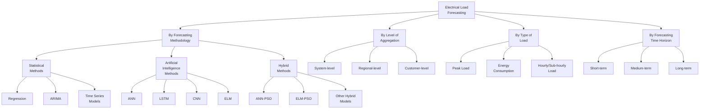

## **CHAPTER 2. OVERVIEW OF ELECTRICAL LOAD FORECASTING**

## **2.1 Concept and Role of Electrical Load Forecasting**

## **2.1.1 Classification of Forecasting**

To provide a systematic overview, electric load forecasting can be classified according to several criteria such as forecasting methodology, level of aggregation, type of load, and forecasting time horizon. These classification approaches and their relationships are illustrated in Figure 1.1.

_Figure 2.1 Classification of Load Forecasting_

In practical applications, the most common and widely accepted classification of electric load forecasting is based on the forecasting time horizon, which includes short-term load forecasting (STLF), medium-term load forecasting (MTLF), and long-term load forecasting (LTLF) [1].

**Short-term load forecasting** typically covers a time horizon ranging from a few minutes to several days ahead, commonly from 1 hour to 24 or 48 hours. This type of forecasting plays a crucial role in real-time operation of power systems, such as unit commitment, economic dispatch, load balancing, and frequency control. Short-term load demand is highly influenced by weather conditions and timerelated factors, making it suitable for advanced data-driven and artificial intelligence-based models.

**Medium-term load forecasting** focuses on a forecasting horizon from several weeks to months, or up to one year. It is mainly applied in maintenance scheduling, fuel procurement, and operational planning of power generation and transmission systems. Seasonal variations, economic conditions, and consumer behavior are significant factors in medium-term forecasting.

**Long-term load forecasting** deals with horizons of several years, typically from 3 to 20 years. It is essential for strategic planning, including power system expansion, generation capacity investment, and transmission network development. Long-term forecasting is strongly affected by macroeconomic indicators, population growth, industrial development, and energy policies rather than short-term load fluctuations.

Among these categories, short-term load forecasting is considered the most challenging due to its high volatility and sensitivity to external factors. Therefore, enhancing the accuracy of short-term forecasting remains a critical research topic in modern power systems.

## **2.1.2 Short-Term Load Forecasting in Power System Operation**

Short-term load forecasting (STLF) plays a critical role in the **secure, reliable, and economical operation of power systems** . Accurate short-term forecasts provide essential information for system operators to make timely operational decisions in daily and hourly time scales.

_Figure 2.2 Daily demand across seasons (Source: New England ISO)[1]_ One of the most important applications of STLF is **unit commitment and economic dispatch** [4]. Based on short-term load forecasts, power generation units are scheduled to operate in an optimal manner, ensuring that electricity demand is met at minimum operational cost while satisfying technical constraints. Inaccurate

> 1 Available: https://www.iso-ne.com/isoexpress/web/reports/load-and-demand. Accessed: Jan. 2026.

forecasts may lead to either excessive reserve allocation or insufficient generation capacity, both of which increase operational costs and system risks.

In addition, STLF is crucial for **real-time balancing and frequency control** in power systems. Since electricity cannot be stored economically on a large scale, generation must continuously match demand. Precise short-term forecasts help system operators maintain power balance, reduce frequency deviations, and enhance overall system stability.

Short-term load forecasting also supports the **integration of renewable energy sources** , such as wind and solar power. The variability and uncertainty of renewable generation increase the complexity of system operation. Accurate STLF enables better coordination between conventional generators and renewable sources, thereby improving system flexibility and reducing the need for expensive backup reserves.

Furthermore, STLF contributes to **preventing system congestion and overload conditions** . By anticipating peak load periods, operators can implement preventive measures such as load shifting, demand response, or network reconfiguration. This helps improve the reliability of transmission and distribution systems and reduces the probability of blackouts.

Due to its strong dependence on weather conditions, time-related factors, and human activities, short-term load demand exhibits high nonlinearity and volatility. Consequently, improving the accuracy of short-term load forecasting remains a major challenge and an active research topic. This has motivated the application of advanced artificial intelligence and hybrid optimization techniques, such as the ELM-PSO model proposed in this study.

## **2.2 Factors Affecting Electrical Load**

Electric load demand is influenced by various factors related to **weather conditions, time characteristics, and socio-economic activities** . These factors interact in a complex and nonlinear manner, making load forecasting a challenging task, especially in short-term horizons. Understanding the impact of these factors is essential for selecting appropriate input variables and improving forecasting accuracy.

## **2.2.1 Weather Factors**

Weather conditions are among the most significant factors affecting electric load demand, particularly in short-term load forecasting. **Temperature** has a direct impact on electricity consumption due to the widespread use of heating, ventilation, and air conditioning (HVAC) systems [5]. Extreme temperatures, either high or low, often lead to sharp increases in electricity demand.

In addition to temperature, **humidity** also influences load demand by affecting human comfort levels and the operational efficiency of cooling systems. Other

meteorological variables such as wind speed, solar radiation, and rainfall may indirectly affect electricity consumption, especially in regions with high penetration of renewable energy sources. Due to their strong correlation with load demand, weather-related variables are commonly used as input features in modern forecasting models.

## **2.2.2 Time Factors**

Electric load demand esxhibits clear **temporal** patterns associated with human activities and social habits. Time-related factors include the **time of the day, day of the week** , and **seasonal variations** . Typically, daily load profiles show peak demand during working hours and lower consumption during nighttime.

Weekly patterns also exist, with load demand on weekdays generally higher than that on weekends. In addition, special days such as **public holidays** and **festivals** often lead to abnormal load behavior compared to regular days. Incorporating time indicators into forecasting models helps capture periodic patterns and improves prediction performance.

## **2.2.3 Socio-Economic Factors**

Socio-economic factors play a more dominant role in medium-term and long-term forecasting but can also influence short-term demand. Factors such as **population growth, industrial activity, income level** , and **lifestyle changes** contribute to variations in electricity consumption.

Urbanization and industrial development typically lead to sustained increases in load demand, while economic downturns may cause demand reduction. Government policies related to energy efficiency and demand-side management can also alter consumption patterns. Although these factors change slowly over time, they are essential for understanding long-term load trends and system planning.

## **2.3 Overview of Existing Forecasting Methods**

Due to the complex, nonlinear, and time-varying characteristics of electric load demand, numerous forecasting methods have been proposed and developed over the years. These methods can generally be classified into **traditional statistical methods** and **artificial intelligence–based methods** , each with its own advantages and limitations.

## **2.3.1 Traditional Statistical Forecasting Methods**

Traditional statistical methods are among the earliest approaches used for electric load forecasting. These methods rely on historical load data and mathematical models to identify linear relationships and temporal patterns.

Common statistical techniques include **linear regression, autoregressive (AR)** models, **autoregressive moving average (ARMA)** , and **autoregressive**

**integrated moving average (ARIMA)** models. Regression-based models are simple to implement and provide clear interpretability, but they often struggle to capture nonlinear relationships in demand.

Time series models such as ARIMA are effective in modeling stationary load patterns and short-term trends [4]. However, their performance degrades when dealing with highly volatile data, abrupt load changes, and external influencing factors such as weather conditions. As a result, traditional statistical methods are often insufficient for modern short-term forecasting problems [6].

## **2.3.2 Artificial Intelligence–Based Forecasting Methods**

With the advancement of computational power and data availability, artificial intelligence (AI) techniques have been widely applied to electric load forecasting. These methods are capable of modeling **nonlinear and complex relationships** between input variables and load demand.

Artificial neural networks (ANNs) are among the most commonly used AI methods in load forecasting. Variants such as **backpropagation neural networks (BPNN)** , **recurrent neural networks (RNN)** , and **long short-term memory (LSTM)** networks have demonstrated superior performance compared to traditional methods, especially in short-term forecasting.

In addition, deep learning models such as **convolutional neural networks (CNN)** have been applied to extract temporal and spatial features from load data. Despite their high accuracy, these models often require large datasets, long training times, and careful parameter tuning.

The **Extreme Learning Machine (ELM)** , a single-hidden layer feedforward neural network, has gained attention due to its extremely fast training speed and simple structure. ELM randomly assigns input weights and biases and computes output weights analytically, making it suitable for real-time forecasting applications. However, the randomness of hidden-layer parameters may lead to unstable performance and suboptimal accuracy [7].

_Table 2.1 Comparison of Load Forecasting Methods_

|**Energy Load** **Forecasting** **Techniques**|**Specific Model Used**|**Strength**|**Weakness**|
|---|---|---|---|
|Regression [8]|Linear Regression and Multiple Linear Regression|Very useful in non-real time forecasting. Functional relationship between previous, forecast load and other factors such as weather, time of the day.|Not accurate for real time load and unable to handle nonlinear load consumption. Adding parameters make it unstable.|

|Time-series Analysis [4]|Auto Regressive Moving Average (ARMA), Auto Regressive Integrated Moving Average (ARIMA), Deterministic decomposition.|They possess abilities to accommodate seasonal component effects.|They suffer from numerical instability.|
|---|---|---|---|
|Artificial Neural Network|Multilayer Perceptrons, Back Propagation Algorithm, Steepest descent Error Back Propagation.|Ability to handle nonlinear relationships in load consumption by adjusting its weight during the training process.|Large amounts of data are needed to train the model and complexity in the training of such data.|
|Fuzzy Inference System|Defuzzification Method using Centre of Area, Middle of Maxima, Last of Maxima and Centre of gravity|Faster and more accurate in performance including simplicity in rule formation.|Selection of membership functions to form its rule is based on trial and error.|
|Support Vector Machine|Support Vector Regression using Incremental Learning Algorithm, Support Vector Regression.|It enhances higher feature space dimensionality by using ϵ-insensitive loss for linear regression computation and reduction in model complexity.|Choosing of suitable kernel and difficulties in its interpretation are major concerns.|

## **2.3.3 Evaluation and Selection of the ELM-PSO Approach**

To overcome the limitations of individual forecasting methods, **hybrid models** combining neural networks and optimization algorithms have been proposed. These hybrid approaches aim to improve forecasting accuracy by optimizing model parameters and enhancing generalization capability.

Particle Swarm Optimization (PSO) is a population-based optimization algorithm inspired by the social behavior of bird flocks and fish schools. PSO has been widely used to optimize neural network parameters due to its simplicity, fast convergence, and strong global search capability.

By integrating PSO with ELM, the randomness of ELM’s hidden-layer weights and biases can be effectively optimized. The resulting **ELM-PSO model** retains the fast-learning advantage of ELM while achieving higher forecasting accuracy and improved stability. Therefore, the ELM-PSO approach is selected in this study as a suitable solution for short-term electric load forecasting.

## **2.4 Related Works**

The field of short-term electrical load forecasting has witnessed a significant transition from traditional statistical methods to Artificial Intelligence (AI) and

Machine Learning (ML) techniques. Recent studies have focused on improving forecasting accuracy and computational efficiency by comparing various architectures and developing hybrid models.

## **2.4.1 Application of Artificial Neural Networks (ANN)**

In the early stages of AI adoption for load forecasting, Feed-forward Neural Networks utilizing backpropagation algorithms demonstrated superior performance compared to classical extrapolation methods.

A notable study by Dang Quang Khoa (2017) [9] applied Artificial Neural Networks to forecast electricity demand for Vinh City, Vietnam, for the period 2016–2020. The research constructed a two-layer feed-forward network with four input variables: population, GDP, industrial production value, and electricity price. The study concluded that ANN models could capture nonlinear relationships better than traditional elasticity coefficient methods. However, conventional ANNs often suffer from slow convergence rates and susceptibility to local minimal due to the gradient-based learning mechanism.

## **2.4.2 Performance of Extreme Learning Machine (ELM) vs Deep Learning**

To overcome the limitations of iterative training in traditional neural networks, the Extreme Learning Machine (ELM) was introduced as a randomized algorithm for Single-Hidden Layer Feedforward Networks (SLFNs).

A recent comprehensive study by Nguyen Thi Hoai Thu et al. (2024) [10] at Hanoi University of Science and Technology evaluated the performance of ELM against state-of-the-art Deep Learning models, including Convolutional Neural Networks (CNN), Long Short-Term Memory (LSTM), and Gated Recurrent Units (GRU), using 2018 load data from Hanoi. The empirical results demonstrated the superiority of ELM in both accuracy and speed:

- **Accuracy:** For 1-step forecasting, the ELM model achieved the lowest Root Mean Square Error (RMSE) of **91.0 MW** , significantly outperforming LSTM (134.1 MW), ANN (136.7 MW), and GRU (146.8 MW).

- **Computational Efficiency:** ELM exhibited an extremely fast training time of approximately **0.48 seconds** , whereas LSTM and GRU required over 4 and 7 minutes, respectively.

This study confirmed that for short-term forecasting tasks, ELM provides a more efficient solution than complex deep learning architectures while maintaining high accuracy.

## **2.4.3 Research Gap and Proposed Hybrid Approach**

While ELM offers significant advantages in speed, its performance relies heavily on the random initialization of input weights and hidden layer biases. This randomness can lead to fluctuations in forecasting stability. In conclusion, Nguyen Thi Hoai Thu et al. suggested that future improvements could be achieved by combining the model with optimization techniques or creating hybrid models.

Addressing this gap, this thesis proposes a hybrid **ELM-PSO** model. By integrating Particle Swarm Optimization (PSO) to optimize the input weights and biases of the ELM, the proposed approach aims to retain the fast-learning capability of ELM while mitigating its inherent instability, ensuring robust and accurate short-term load forecasting.
