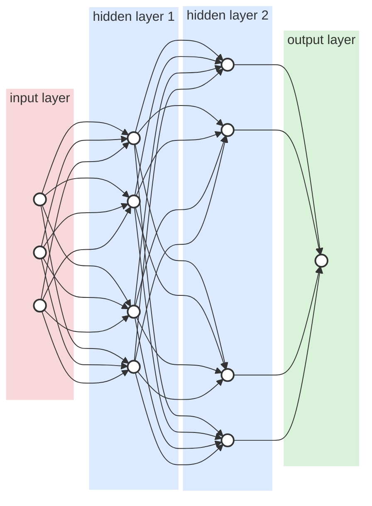

## **3.1 Feedforward Neural Networks**

A feedforward neural network (FNN) is one of the most fundamental and widely used architectures in artificial neural networks. In an FNN, information flows strictly in one direction, from the input layer through one or more hidden layers to the output layer, without forming any feedback or recurrent connections. Due to its simplicity and strong nonlinear approximation capability, the feedforward neural network has been extensively applied in pattern recognition, regression analysis, and electric load forecasting.

A typical feedforward neural network consists of three main components: **the input layer** , **the hidden layer(s)** , and **the output layer** . The input layer receives external signals, such as historical load data, weather variables, and time-related features. The hidden layer is responsible for extracting nonlinear relationships from the input data through weighted connections and activation functions. The output layer produces the final forecasting result.

_Figure 3.1 An example of a Feedforward Neural Network with two hidden layers_ Mathematically, the output of a single hidden-layer feedforward neural network can be expressed as:

$$
y = \sum_{i=1}^{L} \beta_i\, g\left(w_i \cdot x + b_i\right) \tag{3.1}
$$

where

𝒙 is the input vector,

𝐿 is the number of hidden neurons,

𝒘𝑖 and 𝑏𝑖 are the weight vector and bias of the 𝑖-th hidden neuron,

𝑔(⋅) is the activation function, and

𝛽𝑖 denotes the output weight connecting the hidden layer to the output layer.

Common activation functions used in feedforward neural networks include the **sigmoid** , **tanh** , and **rectified linear unit (ReLU)** functions. These nonlinear activation functions enable the network to approximate complex nonlinear mappings between inputs and outputs.

Traditionally, feedforward neural networks are trained using **gradient-based learning algorithms** , such as the backpropagation (BP) algorithm. During training, network weights and biases are iteratively updated to minimize a predefined error function, typically the mean squared error (MSE). Although backpropagation-based FNNs can achieve high forecasting accuracy, they suffer from several limitations, including slow convergence speed, sensitivity to initial parameter values, and the risk of getting trapped in local minima.

In the context of electric load forecasting, these limitations become more pronounced due to the large size of datasets and the highly nonlinear and timevarying nature of load demand. Consequently, alternative learning mechanisms that can improve training efficiency and robustness have attracted increasing research interest. One notable approach is the **Extreme Learning Machine (ELM)** , which is a special form of single-hidden layer feedforward neural network with a significantly simplified training process. The theoretical foundation of ELM is discussed in the following section.
