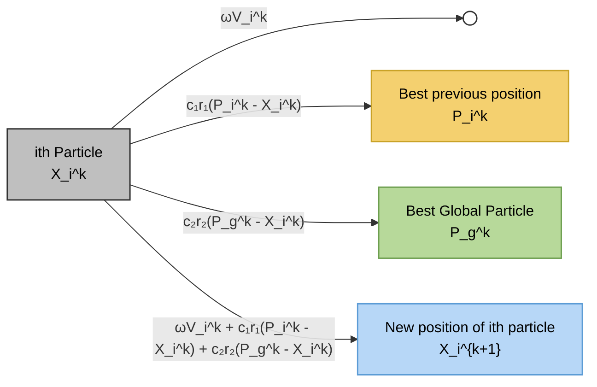

## **3.3 Particle Swarm Optimization (PSO)**

Particle Swarm Optimization (PSO) [3] is a **population-based stochastic optimization algorithm** inspired by the social behavior of bird flocks and fish schools. Since its introduction, PSO has been widely applied to solve nonlinear, nonconvex, and high-dimensional optimization problems due to its simplicity, fast convergence, and strong global search capability.

In PSO, a group of candidate solutions, called **particles** , move through the search space to find the optimal solution. Each particle represents a potential solution and adjusts its position based on its own experience and the collective experience of the swarm.

## **3.3.1 Principle of Particle Swarm Optimization**

Each particle in the swarm is characterized by two main parameters: **position** and **velocity** . The position represents a candidate solution in the search space, while the velocity determines the direction and speed of the particle’s movement.

During the optimization process, each particle keeps track of:

- Its **personal best position** (𝑝𝑏𝑒𝑠𝑡), which is the best solution it has achieved so far.

- The **global best position** (𝑔𝑏𝑒𝑠𝑡), which is the best solution found by the entire swarm.

By sharing information among particles, PSO balances **exploration** (searching new areas) and **exploitation** (refining known good solutions), allowing the swarm to converge toward an optimal or near-optimal solution.

## **3.3.2 Mathematical Model of PSO**

The velocity and position of each particle are updated iteratively according to the following equations:

$$
\begin{aligned}
v_i^{k+1} &= \omega v_i^{k} + c_1 r_1 \left(\mathrm{pbest}_i - x_i^{k}\right) + c_2 r_2 \left(\mathrm{gbest} - x_i^{k}\right) \\
x_i^{k+1} &= x_i^{k} + v_i^{k+1}
\end{aligned}
\tag{3.6}
$$

where

> 𝑘 𝑘 𝐱𝑖 and 𝐯𝑖 are the position and velocity of particle 𝑖 at iteration 𝑘,

𝜔 is the **inertia weight** , controlling the influence of the previous velocity,

𝑐1 and 𝑐2 are the **cognitive** and **social acceleration coefficients** , respectively,

𝑟1 and

𝑟2 are random numbers uniformly distributed in [0, 1].

The inertia weight 𝜔 plays a crucial role in maintaining a balance between global exploration and local exploitation. A larger inertia weight encourages exploration, while a smaller value promotes convergence.

_Figure 3.2 Particle Swarm Optimization architecture illustration_

## **3.3.3 PSO Algorithm Procedure**

The general procedure of the PSO algorithm can be summarized as follows:

1. Initialize the swarm by randomly generating particle positions and velocities.

2. Evaluate the fitness value of each particle using a predefined objective function.

3. Update 𝑝𝑏𝑒𝑠𝑡 and 𝑔𝑏𝑒𝑠𝑡 based on fitness evaluations.

4. Update particle velocities and positions using the PSO equations.

5. Repeat steps 2–4 until the stopping criterion (maximum iterations or convergence threshold) is met.

Due to its straightforward implementation and low computational complexity, PSO is well suited for optimizing neural network parameters.

## **3.3.4 Advantages of PSO in Neural Network Optimization**

When applied to neural networks, PSO offers several advantages:

- **No requirement for gradient information** , making it suitable for nondifferentiable problems

- **Fast convergence speed** compared to many evolutionary algorithms

- **Strong global search capability** , reducing the risk of local minima

- **Simple parameter setting** and easy integration with existing models

These characteristics make PSO an effective tool for optimizing neural network structures and parameters, including weights, biases, and the number of hidden neurons.

## **3.3.5 Motivation for Combining PSO with ELM**

Although ELM provides extremely fast training, its random initialization of input weights and hidden-layer biases may lead to unstable performance. By employing PSO to optimize these parameters, the search space of ELM can be explored more effectively.

The hybrid **ELM–PSO** model combines the fast-learning speed of ELM with the global optimization capability of PSO, resulting in improved forecasting accuracy and robustness. The detailed design and implementation of the proposed ELM– PSO model for short-term electric load forecasting are presented in Chapter 3.
