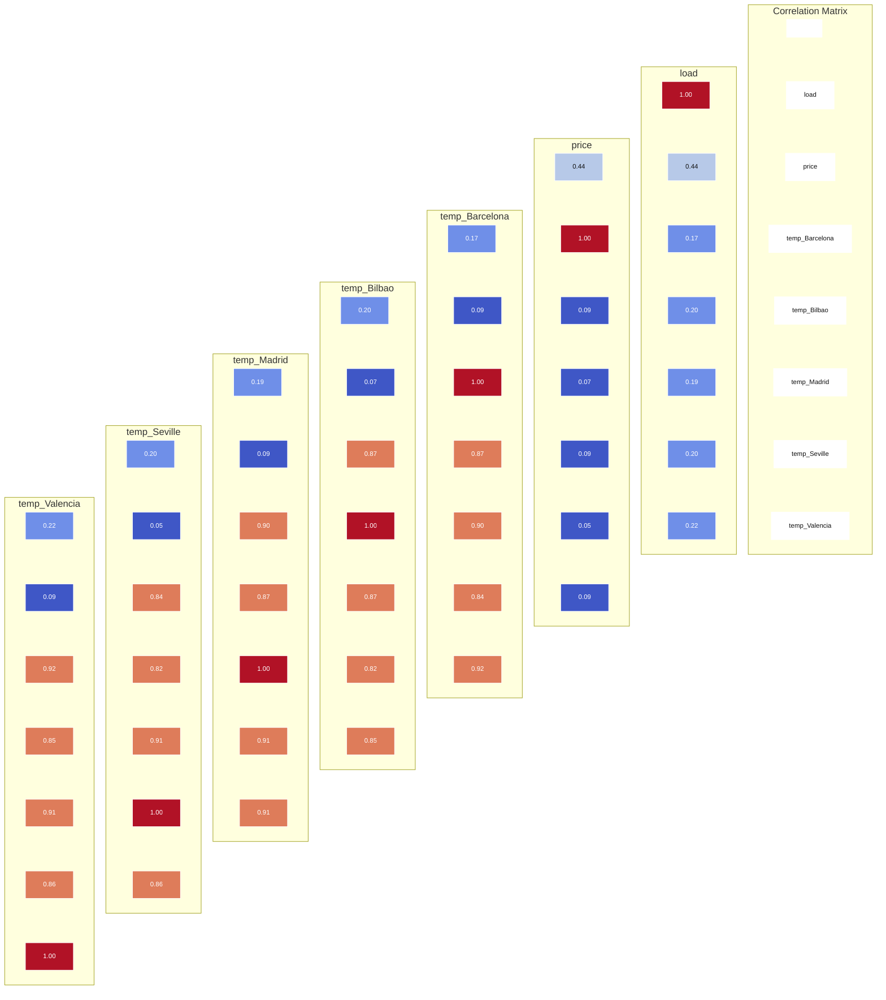

## **4.3 Data Analysis**

Before training the forecasting models, an exploratory data analysis (EDA) was conducted to examine the statistical characteristics and relationships among the input variables. This step aims to ensure data reliability and to provide insights into the dependency between electric load and influencing factors.

## **Correlation Analysis**

_Figure 4.1 Correlation Matrix of Load, Electricity Price, and Temperatures_

As shown in Figure 4.1, the electric load exhibits a clear correlation with temperature variables, confirming the strong influence of weather conditions on electricity consumption. Temperature data from different cities show high mutual correlation, indicating similar climatic patterns across regions. In contrast, the electricity price demonstrates weaker correlation with load demand, suggesting that price plays a secondary role in short-term load variation compared to meteorological factors.

These observations justify the selection of **temperature and historical load data** as key input features for the forecasting model.

## **Distribution Analysis of Load and Price**

To further examine the statistical distribution of the main variables, Figure 4.2 illustrates the **histograms and boxplots of electric load and electricity price** .

The load distribution shows a relatively concentrated range with moderate skewness, reflecting stable consumption behavior with occasional peak demand periods. The boxplot indicates that extreme outliers have been effectively handled during the data cleaning process.

In contrast, electricity price exhibits a wider distribution and higher variability, with several extreme values. This volatility further supports the decision to treat electricity price as a supplementary variable rather than a primary driver in shortterm load forecasting.

## **Comparison of Temperature Distributions Across Cities**

Figure 4.3 compares the **temperature distributions of different cities** included in the dataset.

The figure shows that temperature ranges across cities are consistent and realistic, covering both seasonal cold and hot extremes. Despite minor regional differences, the overall distribution patterns are similar, indicating that the temperature data are reliable and representative of actual climatic conditions.

This consistency ensures that temperature variables can be effectively used as explanatory inputs without introducing bias due to abnormal or unrealistic measurements.

## **Data Verification and Quality Assessment**

After data cleaning and exploration analysis, the dataset was re-verified to ensure its suitability for model training. The verification results are summarized in Error! R eference source not found..

|**Verification** **Criteria**|**Statistical** **Indicator**|**Actual Result**|**Evaluation**|
|---|---|---|---|
|**Data Size**|Total Samples (Rows)|35,064 samples|Sufficient for Deep Learning|
|**Integrity**|Missing Values (NaN)|0|Pass (100% Clean)|
||Duplicate Rows|0|Pass|
|**Continuity**|Time Period|01/01/2015 - 31/12/2018|4 continuous years|
||Resolution|1 hour (Hourly)|Stable|
|**Value Range**|Load|18,041 MW - 41,015 MW|Reasonable|
||Price|9.33 EUR - 116.80 EUR|Reasonable|
||Temperature|Min: -10.91°C; Max: 42.45°C|Consistent with actual climate|

_Table 4.1 Summary of Input Data Verification Results_

The verification results indicate that the dataset contains **35,064 hourly samples** , corresponding exactly to four continuous years from **January 1, 2015 to**

**December 31, 2018** . No missing values or duplicate records are detected, confirming complete data integrity.

Furthermore, all variables fall within reasonable physical ranges. The electric load varies from **18,041 MW to 41,015 MW** , while temperature values range from **– 10.91°C to 42.45°C** , which are consistent with real-world operating and climatic conditions. These results demonstrate that outliers and unrealistic values have been effectively addressed during preprocessing.

Overall, the dataset satisfies the requirements for short-term load forecasting and provides a reliable foundation for training and evaluating the proposed ELM–PSO model.
