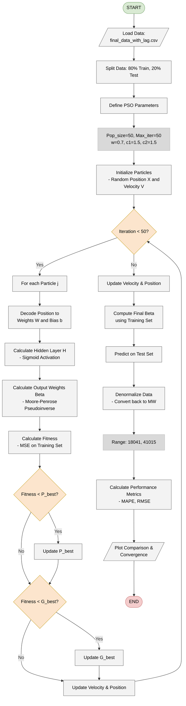

## **4.6 Block Diagram of the ELM-PSO Neural Network**

_Figure 4.4 Block diagram of the ELM-PSO Neural Network_

The flowchart illustrates the operational workflow of the electrical load forecasting program using the hybrid PSO-ELM model. The process is divided into three main phases:

## **4.6.1 Initialization and Data Processing Phase**

- **Load Data:** The program initiates by loading the final_data_with_lag.csv file.

- **Data Splitting:** The dataset is split sequentially (without random shuffling to preserve temporal order) into **80% for Training** and **20% for Testing** .

- **PSO Parameter Setup:** Operational parameters for the Particle Swarm Optimization algorithm are set according to the source code:

   - Population size: 50 particles.

   - Max iterations: 50.

   - Inertia weight (𝑤 **):** 0.7.

   - Acceleration coefficients (𝑐1, 𝑐2): Both set to 1.5 **.**

- **Swarm Initialization:** Random positions (representing weights 𝑊 and biases 𝑏) and initial velocities are generated for particles within the search space [−1, 1].

## **4.6.2 Optimization Loop Phase (PSO Loop)**

This is the core of the algorithm, executed for 50 iterations:

- **Particle Decoding:** In each iteration, the position of every particle is decoded into the input weight matrix W and bias vector b of the ELM network.

- **ELM Computation:**

   - Compute the hidden layer matrix 𝐻 using the **Sigmoid activation function** .

   - Compute the output weights 𝛽 using the **Moore–Penrose Pseudoinverse** method.

- **Fitness Evaluation:** Calculate the **Mean Squared Error (MSE)** between the predicted and actual values on the **Training set** .

- **Update:**

   - Compare the current fitness with the **Personal Best** (𝑃𝑏𝑒𝑠𝑡) and **Global Best** (𝐺𝑏𝑒𝑠𝑡), update them if a better solution is found.

   - Calculate new velocities and move particles to new positions based on the PSO velocity update formula.

## **4.6.3 Forecasting and Evaluation Phase**

- **Optimal Model Construction:** After the loops conclude, the best parameter set from 𝐺𝑏𝑒𝑠𝑡 is extracted to construct the final ELM network.

- **Prediction:** The network performs forecasting on the Test set (unseen data).

- **Denormalization:** The forecast results (currently in normalized 0-1 form) are converted back to actual power units (MW) based on the range [18041, 41015].

- **Termination:** Calculate MAPE and RMSE metrics, and plot comparison charts.
